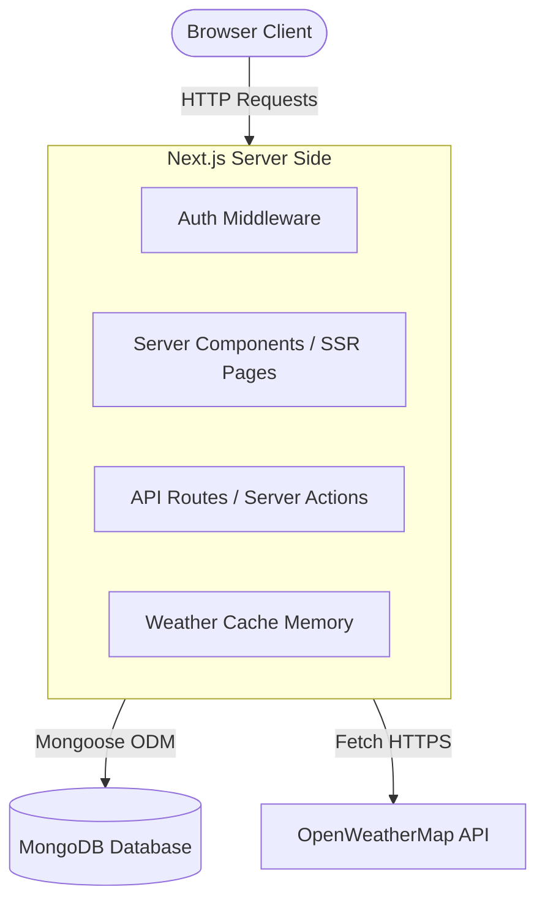
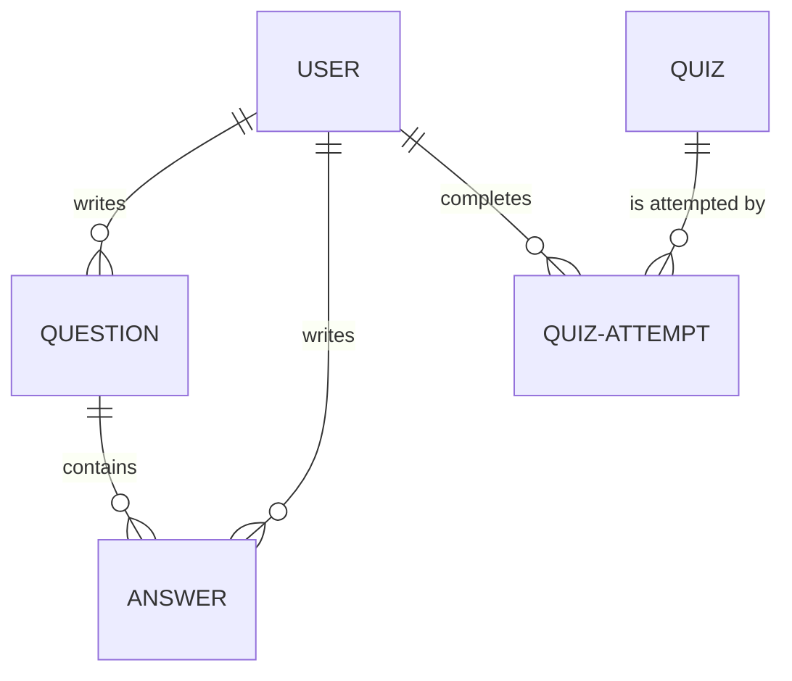

# System Design & Architecture: DevSpace

This document outlines the system architecture, database schema, and core data flows for **DevSpace**, our developer knowledge hub and assessment platform.

---

## 1. System Architecture

We will build DevSpace using a **Next.js App Router** architecture. Next.js gives us a hybrid model of Server Components and Client Components, allowing us to build a fast, SEO-friendly, and interactive application.



### Server vs. Client Boundary Design

- **Server Components (Default)**: Used for landing pages, question lists, question detail pages, and profiles. These compile on the server and fetch data directly from MongoDB, eliminating client-side loading spinners and improving SEO.
- **Client Components (`"use client"`)**: Used for interactive forms (asking questions, writing markdown answers, taking quizzes, toggling themes). These handle local state, animations, and immediate user actions.

---

## 2. Database Schema (Mongoose Models)

We will use MongoDB with Mongoose to model our data. We need to handle users, questions, answers, quizzes, and tracking quiz attempts.



### Schema Definitions

#### A. User Schema (`User`)

Represents the registered developers on the platform, including their reputation and gamification stats.

```typescript
{
  username: { type: String, required: true, unique: true, index: true },
  email: { type: String, required: true, unique: true, index: true },
  passwordHash: { type: String, required: true },
  reputation: { type: Number, default: 0 },
  badges: [{ type: String }], // e.g., ['js-wizard', 'top-contributor']
  themePreference: { type: String, enum: ['light', 'dark'], default: 'dark' },
  location: { type: String }, // Used to query weather
  createdAt: { type: Date, default: Date.now }
}
```

#### B. Question Schema (`Question`)

```typescript
{
  title: { type: String, required: true, index: true },
  content: { type: String, required: true }, // Markdown string
  tags: [{ type: String, index: true }], // For indexing tag searches
  author: { type: Schema.Types.ObjectId, ref: 'User', required: true },
  upvotes: [{ type: Schema.Types.ObjectId, ref: 'User' }], // Array of user IDs to prevent double voting
  downvotes: [{ type: Schema.Types.ObjectId, ref: 'User' }],
  views: { type: Number, default: 0 },
  createdAt: { type: Date, default: Date.now }
}
```

#### C. Answer Schema (`Answer`)

```typescript
{
  content: { type: String, required: true }, // Markdown string
  question: { type: Schema.Types.ObjectId, ref: 'Question', required: true, index: true },
  author: { type: Schema.Types.ObjectId, ref: 'User', required: true },
  upvotes: [{ type: Schema.Types.ObjectId, ref: 'User' }],
  downvotes: [{ type: Schema.Types.ObjectId, ref: 'User' }],
  isAccepted: { type: Boolean, default: false },
  createdAt: { type: Date, default: Date.now }
}
```

#### D. Quiz Schema (`Quiz`)

```typescript
{
  title: { type: String, required: true },
  description: { type: String },
  questions: [{
    questionText: { type: String, required: true },
    options: [{ type: String, required: true }],
    correctOptionIndex: { type: Number, required: true }
  }],
  difficulty: { type: String, enum: ['easy', 'medium', 'hard'], default: 'medium' },
  xpReward: { type: Number, default: 100 },
  createdAt: { type: Date, default: Date.now }
}
```

#### E. QuizAttempt Schema (`QuizAttempt`)

Logs user performance on assessments to update profile statistics and reputation.

```typescript
{
  user: { type: Schema.Types.ObjectId, ref: 'User', required: true, index: true },
  quiz: { type: Schema.Types.ObjectId, ref: 'Quiz', required: true },
  score: { type: Number, required: true }, // percentage, e.g., 85
  completedAt: { type: Date, default: Date.now }
}
```

---

## 3. Key Data Flows

### A. Reputations & Badges Pipeline

When an event happens, how does the database update reputation points?

- **Upvote on Answer**: Target answer's author receives **+10 Reputation**.
- **Upvote on Question**: Target question's author receives **+5 Reputation**.
- **Accepted Answer**: Author receives **+20 Reputation**.
- **Quiz Success (score >= 80%)**: User receives **+50 Reputation** and potential badge validation (e.g., if JS Quiz is completed, add `'js-wizard'` badge).

### B. Third-Party Weather API with Server caching

To fetch the weather without hitting rate limits or slowing down the dashboard:

1. User loads Dashboard.
2. Next.js Server check if we have weather data cached in memory (or redis/mongodb) for the User's `location` that is less than 30 minutes old.
3. **If cached**: Return cached weather.
4. **If expired/missing**: Call OpenWeatherMap API, store in cache, and return response.

---
